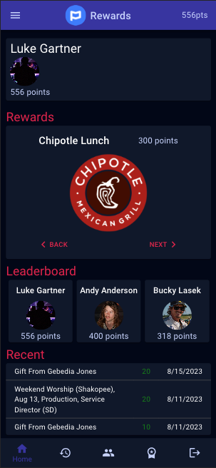
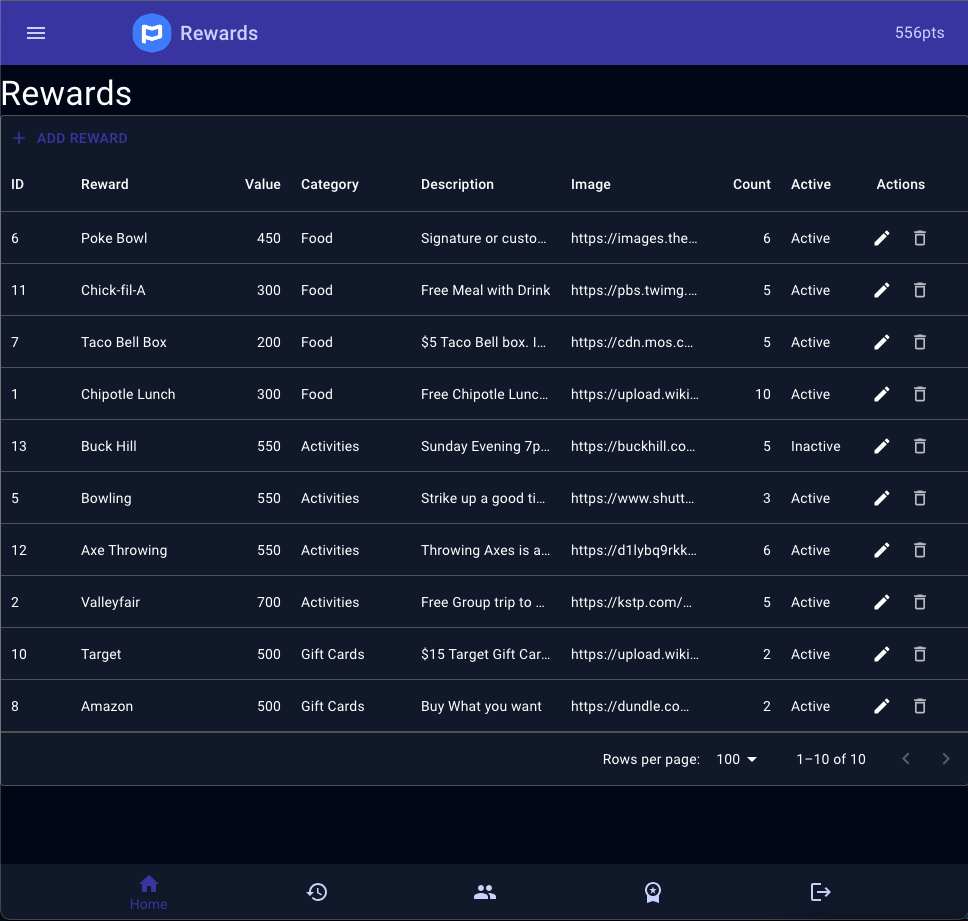

# Rewards (Planning Center)

This rewards application uses Planning Center's API to automatically award points based on volunteers confirmations to serve on particular date's. Admins can create an manage rewards and users in the platform.

This applications solves the problem of underutilized volunteer appreciation budgets that is common in my workplace. It both provides a means of further engaging volunteers and rewarding them by directing the budget more strategically.

## Screenshots

## Tech Stack

**Client:** React, Redux, Material UI, Javascript, HTML, CSS

**Server:** Node, Express, PostgreSQL
